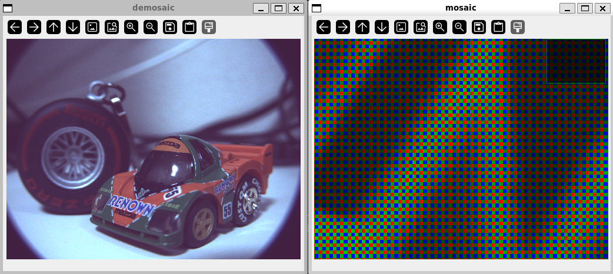

# Tiny Python raw bayer image viewer

## Usage
```
python bayer_py.py -i imx477_16bit_4056_3040.raw -j imx477.json
```

## Screenshot


## TODO
8bit image support  
more bayer pattern support  
dng(exif) support  
とか  
